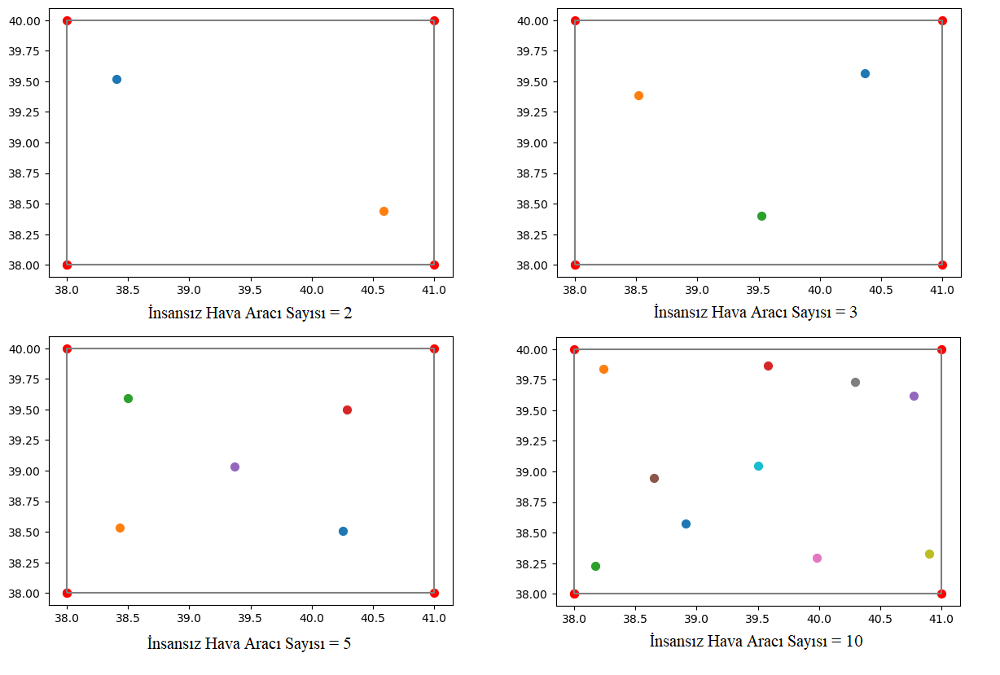
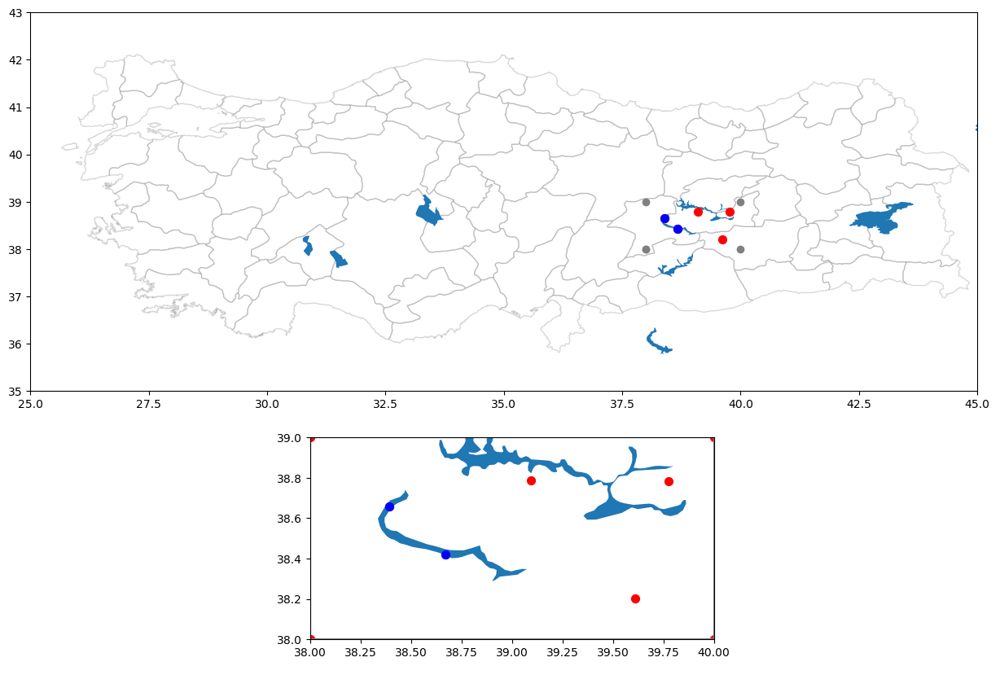

# Positioning Unmanned Vehicles
This project ensures that the desired number of unmanned surface and unmanned aerial vehicles are distributed homogeneously to the selected work area. Which provides a solution for the coordinated operation of different types of vehicles, creates a categorized and homogeneous distribution by understanding the water data in the selected work area. In order to obtain realistic results in the project, the study area was created with real map data. The data obtained by spatial data analysis was obtained from the official site "gadm.org".
## Realistic Workspace
Homogeneous distribution was performed using real map data.
## Categorized Homogeneous Distribution
Positioning of different types of unmanned surface and unmanned aerial vehicles is provided.

### Only positioning of unmanned aerial vehicles

### Categorized positioning

